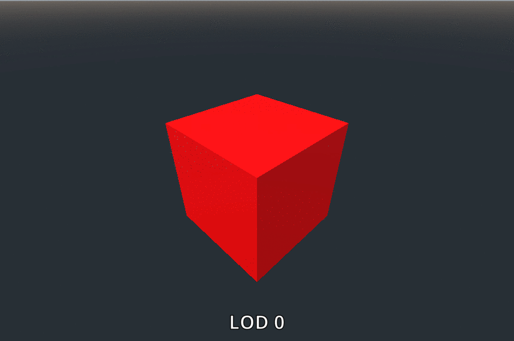

# Godot Engine 3D LOD (Level of Detail)
3D LOD (Level of Detail) system for Godot Engine featuring lod0, lod1, and lod2 presets plus culling at a set distance.

Simply add the lod.gd and icon.svg files (in the same directory) to a Godot project to use the new LOD node extending from Spatial. There's no need to change anything in the project settings. Tweak the values in the editor to achieve the intended result. Please note that the LOD does not work in editor, and the original visibility of the LODs does not affect runtime.
